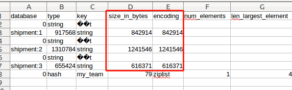
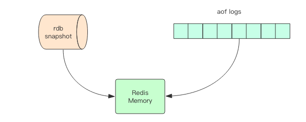
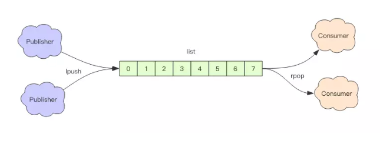
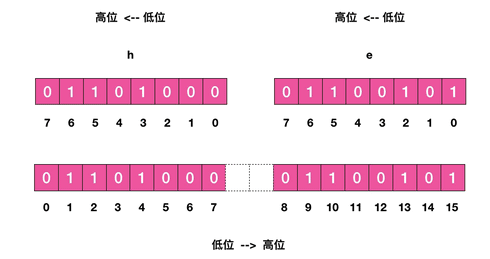
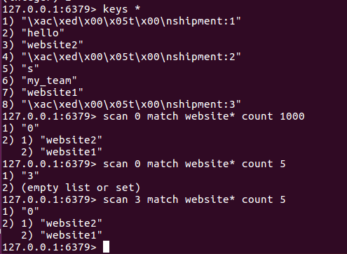
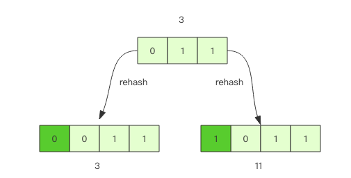
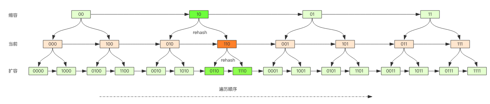
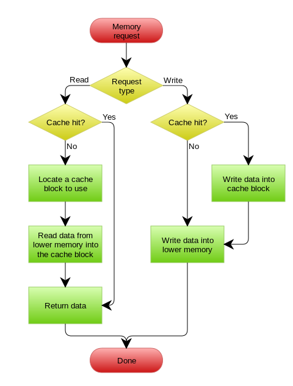
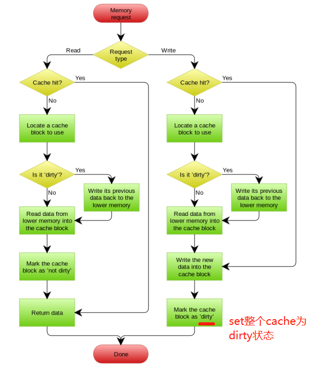

## Redis
* 定义：是一个开源的使用 ANSI C 语言编写、支持网络、可基于内存亦可持久化的日志型、Key-Value、NoSql 数据库，并提供多种语言的 API。

## SpringBoot Redis基本用法
`spring-boot-starter-data-redis`中的`RedisTemplate`对Jedis的相关redis操作方法进行了高度封装。
* 基本操作类（每次做操作都显示声明key）：
  * ValueOperation: 简单k-v操作
  * SetOperations: set集合操作
  * ZSetOperations, HashOperations, ListOperations
* 一次bound key即可各种操作的操作类：
  * BoundKeyOperations, BoundSetXxxx, BoundListXxxx, BoundHashXxxx
* 默认不开启事务

## 知识点
* `spring-boot-starter-data-redis` 与 `spring-boot-starter-redis` 的区别
  答：SpringBoot从1.4版本开始，`spring-boot-starter-redis` 就改名了，两者都是依赖以下三个库，没有区别：
  1. `org.springframework.boot.spring-boot-starter`
  2. `org.springframework.data.spring-data-redis`
  3. `redis.clients.jedis` （从Spring Boot 2.x 后， 就改为了 `io.lettuce.lettuce-core`）

* `Jedis`与`Lettuce`
  1. 两者同为Java客户端
  2. Jedis基于Java，在实现上是直接连接Redis-Server，在多个线程共享一个Jedis实例时，线程不安全。So，如果想在多线程环境下使用Jedis，需要使用线程池，每个线程都使用自己的Jedis实例，当连接数增多时，会消耗较多的物理资源。
  3. Lettuce 是线程安全的、可伸缩的 Redis客户端，支持同步、异步和响应式模式。在多线程共享同一个connection实例时，不必担心多线程并发问题。基于Netty NIO框架，支持Redis一些高级功能如：Sentinel，集群，流水线，自动重连和Redis数据模型。
  

* Jedis与JedisTemplate区别
  * Jedis是Redis官方推荐的面向Java的操作Redis的客户端，而RedisTemplate是SpringDataRedis中对JedisApi的高度封装。
  * SpringDataRedis相对于Jedis来说可以方便地更换Redis的Java客户端，比Jedis多了自动管理连接池的特性，方便与其他Spring框架进行搭配使用如：SpringCache

* Redis 字符串最大可容纳大小： `512 Mb`

## 相关库
* 序列化库protostuff（号称比fastjson还要快，大小75%，速度50%）
  * `io.protostuff:protostuff-core:1.6.0`
  * `io.protostuff:protostuff-runtime:1.6.0`
* `RedisTamplate`默认采用：`JdkSerializationRedisSerializer`作为序列化策略

## 效率对比
|Redis input/output方式|写入速度|读取速度|
|:----:|:----:|:----:|
|JedisTemplate原生对象序列化存Redis字符串| ~200ms/1.5MB | 90~120ms |
|Protostuff库序列化存Redis字符串| ~200ms/1.5MB | firstTime:500ms, 45~90ms |
|Fastjson库序列化存Redis字符串| ~200ms/1.5MB | firstTime:1000ms, 110~300ms |

用 1.5MB/条的仿shipment数据来做测试：

发现，Protosuff序列化的压缩能力最强，而json序列化的压缩能力最弱。

## Redis持久化
> 目的：保证Redis的数据不会因故障而丢失

持久化机制：

* 快照（RDB）
  * 一次全量备份
  * 快照是内存数据的二进制序列化形式，在存储上非常紧凑。
* AOF日志
  * 连续增量备份
  * AOF日志记录的是内存数据修改的指令记录文本。
  * AOF日志 在长期运行过程中，会变得无比庞大，数据库重启时需要加载AOF日志进行指令重放，这个时间相当漫长， 所以需要定期进行AOF重写，给AOF日志进行瘦身。
  
## 分布式锁
* 锁冲突处理（client端处理请求时加锁没有加成功时）：
  1. 抛出异常，通知用户稍后重试（本质上是放弃当前请求，重新发起新请求，达到人工延时的效果）
  2. sleep一会在重试（阻塞当前消息处理线程，导致队列的后续消息处理出现延迟。所以碰撞频繁或者队列内消息很多的情况下，不适用。如果因个别死锁的key导致加锁不成功，则consumer线程会彻底堵死，后续消息永远得不到处理。）
  3. 将请求转移到延时队列，过一会重试（适用于异步消息处理，即将当前冲突的请求扔到另一个队列延时后处理以避开冲突。）
  
  
## Redis应用：异步消息队列与延时队列
这个功能当然无法和现在主流的Rabbitmq和Kafka等消息队列中间件来比，实际上就是利用redis基本数据结构 list(列表) 的特性，去操作出队入队，从而去充当一个简单的异步消息队列。
对于只有一组consumer的MQ，用Redis很容易实现。只是，没有ack保证，如果对message的可靠性有极致的追求，就不适用Redis.

#### 异步消息队列实现方法：List 各种push和pop，配合线程sleep

  
  > 可是如果队列空了，客户端就会陷入 pop 的死循环，不停地 pop，没有数据，接着再 pop，又没有数据。这就是浪费生命的空轮询。空轮询不但拉高了客户端的 CPU，redis 的 QPS 也会被拉高，如果这样空轮询的客户端有几十来个，Redis 的慢查询可能会显著增多。
  > 解决方法： 
    1. consumer线程sleep 1s
    2. 使用`brpop/blpop`(阻塞读)，当队列中没有数据时，会立即进入休眠状态，一旦数据到来，立刻醒过来。
   
当然，还会有个问题：**空闲连接自动断开**。 如果线程一直阻塞，Redis client connection 就会变成闲置连接，闲置过久，服务器一般会主动断开连接，减少闲置资源占用。
这时，如果用`brpop/blpop`就会抛异常。 所以，client端 consumer 需要捕获处理异常，并且重试。


#### 延时队列实现方法：ZSet，以序列化后的message内容作为value，以消息到期处理时间为score
* 当多个线程同时去争抢，用`zrem` 在有序集合中的一个task弹出，谁抢到了，就做后续`handle`，抢不到，就不做任何处理。

# 位图（byte数组）
> 一些bool类型的数据需要存取，比如每天的签到记录。用位图数据结构，就能够每天1bit，每人365天就46个byte搞定。

其实位图数据结构，背后就是普通的字符串，也就是byte数组。配合`getbit/setbit`等就能够将byte数组 当成 bit数组 来处理。

例子讲基本操作：

* `setbit`
  ```shell
  # 对s的第2个bit位置，设为1
  setbit s 1 1
  # 对s的第3个bit位置，设为1
  setbit s 2 1
  setbit s 4 1
  setbit s 9 1
  setbit s 10 1
  setbit s 13 1
  setbit s 15 1
  get s
  # "he"
  ```
* `getbit`
  比如获取上面这个`s`的第3个bit位置：`gitbit s 2`
* `bitcount`
  比如：我要统计人员week 1~2 的这16天共签到了多少天（1byte = 8bit）：`bitcount qiandao 0 1`，直接输入1的个数。
* `bitpos`
  查看人员从最开始的16天的第一次签到是第几天：`bitpos qiandao 0 1`
* `bitfield`
  * `bitfield s get u3 2` 从第3个bit开始取3bits，结果是无符号数（u）
  * `bitfield s get i4 0` 从第1个bit开始取4bits，结果是有符号数（i）
  * `bitfield s get u4 0 get u3 2 get i4 0` 一次跑多个子指令
  * `bitfield s incrby u4 2 1` 从第3个bit开始取4bits，并对结果+1 （15+1折返，变回0）
  * `bitfield s overflow sat incrby u4 2 1` 饱和拦截（15 + 1 = 15）
  * `bitfield s overflow fail incrby u4 2 1` 失败不执行（15+1不执行）

# HyperLogLog
* 定义：`pf`:发明人 Philippe Flajolet 的首字母缩写
* 作用：解决精度不高的统计需求
* 缺点：不能知道某个值是不是已经存在HyperLogLog中。（没有`pfcontains`方法）
* 操作指令：
  * `pfcount`：统计结果
  * `pfadd`：增加计数(具备去重功能)
  * `pfmerge [目标key] [源key]`:计数合并（如：两个页面的统计值合并）
* 例子：要统计每天某个页面的访问用户数目
    ```shell
    pfadd website1 user1 user2 user3 user4
    pfadd website2 user4 user5
    pfcount website1
    # 4
    pfcount website2
    # 2
    pfmerge website1 website2
    pfcount website1
    # 5
    pfcount website2
    # 2
    ```

# 布隆过滤器
> 背景：Redis官方体用的布隆过滤器到了Redis4.0提供了插件功能之后才正式登场。作为一个插件加载到Redis Server中，给Radis提供强大的布隆去重功能。

* 定义：可理解为一个不怎么精确的set结果，当我们使用它的`contains`方法去判断某个对象是否存在是，可能会误判。但是误判概率很小。
* 特点：它说A不存在，A肯定不存在；它说A存在，可能是骗你的。

# 简单限流
# 漏斗限流（funnel）
# GeoHash
> 背景：Redis v3.2 后 增加了地图位置 GEO模块

# Scan

### (一) keys
* 指令：
  * `keys`(列出所有满足特定正则的key):
    * `keys *`
    * `keys str*`
    * `keys hel*d`
* 缺点：
  * 没有`offset`,`limit`参数，全查询，查询结果数据量一旦大，那就很尴尬。
  * keys算法是遍历算法，复杂度为`O(n)`，如果key很多，找key的过程就延时大，可能超时。（Redis是单线程程序，顺序执行所有指令，其他指令必须等到当前的keys指令跑完，才能继续。）。

### (二) scan
> 背景： Redis v2.8 中加入

* 特点：
  * 复杂度虽然也是 `O(n)`，但是它是通过游标分步进行的，不会阻塞线程;
  * 提供 `limit` 参数，可以控制每次返回结果的最大条数，limit 只是一个 hint，返回的结果可多可少;
  * 同 `keys` 一样，它也提供模式匹配功能;
  * 服务器不需要为游标保存状态，游标的唯一状态就是 scan 返回给客户端的游标整数;
  * **返回的结果可能会有重复，需要客户端去重，这点非常重要**;
  * **遍历的过程中如果有数据修改，改动后的数据能不能遍历到是不确定的**;
  * 单次返回的结果是空的并不意味着遍历结束，而要看返回的游标值是否为零; 
* 指令：
  `scan <cursor> match <key正则模式> <遍历的limit hint>`
  注意：第一次的cursor为0，每次遍历完，返回两条记录，第一条记录就是cursor当前值（整数），只要这个值不为0，就表示keys没有遍历完毕。
  
  
* 更多指令：
  * `zscan`：遍历zset集合元素
  * `hscan`：遍历hash字典元素
  * `sscan`：遍历set集合元素

### keys的存储原理：字典结构
* 原理：在Redis中，所有的key都被存储在一个很大的字典中，这个字典的结构与Java中的HashMap一样（一维数组+二维链表 结构），第一维数组的大小总是 2^n (n >= 0)，扩容一次数组大小空间翻倍（n++）
而`scan`指令返回的游标就是第一维数组的位置索引（称为：槽 slot）。如果不考虑字典的扩容缩容，那么直接按照数组下表挨个遍历就OK。
`limit`参数就表示需要遍历的槽位数，之所以返回的结构可能多可能少，是因为并非所有的槽位上都会挂接链表，而有些槽位上挂接的链表元素可能会有多个。
每一次遍历都会将limit数量的槽位上挂接的所有链表元素进行模式匹配过滤后，一次性返回给client端。
* scan 的遍历顺序非常特别。它不是从第一维数组的第 0 位一直遍历到末尾，而是采用了**高位进位加法**（0 -> 8 -> 4）来遍历。之所以使用这样特殊的方式进行遍历，是考虑到字典的扩容和缩容时避免槽位的遍历重复和遗漏。
* 字典扩容：
  * 原理：当loadFactor达到阈值时，需要重新分配一个新的2倍大小的数组，然后将所有的元素全部**`rehash`**到新数组下面。
  * rehash原理：rehash就是将元素的hash值对数组长度进行取模运算，因为长度遍历，所以每一个元素挂接的槽位可能也发生了变化。又因为数组的长度是 2^n 次方，所以取模运算等价于位与操作。
    ```shell
    a mod 8 = a & (8-1) = a & 7
    a mod 16 = a & (16-1) = a & 15
    a mod 32 = a & (32-1) = a & 31
    ```
    
    假设开始槽位的二进制数是 xxx，那么该槽位中的元素将被 rehash 到 0xxx 和 1xxx(xxx+8) 中。 如果字典长度由 16 位扩容到 32 位，那么对于二进制槽位 xxxx 中的元素将被 rehash 到 0xxxx 和 1xxxx(xxxx+16) 中。...
    
  * 渐进式rehash：
    * Java的HashMap在扩容时是**一次性**将旧数组下挂接到新数组下面。
    * 而Redis为了解决数据量大的问题，会同时保留 新旧数组，在定时任务中以及有序对hash的指令操作中渐渐将就数组中挂接的元素迁移到新数组上。
    * 当然，渐进式rehash，就意味着要操作处于rehash中的字典，需要同时访问两个数组结构，如果旧的找不到，就去新数组中找。
* 大key造成遍历和内存释放卡顿
  * 如何定位大key?可以使用以下命令：
    > 但是这个命令无法统计出大object序列化后存入redis中的字符串！！！
    
    ```shell
    redis-cli -h 127.0.0.1 -p 6379 –-bigkeys
    # 每隔 100 条 scan 指令就会休眠 0.1s，ops 就不会剧烈抬升，但是扫描的时间会变长
    redis-cli -h 127.0.0.1 -p 6379 –-bigkeys -i 0.1
    ```
    
# Redis与MySql的集群方案
1. 方案一（写DB后缓存失效）：
  * 读数据时，先查Redis，Redis没有，就去查（Redis数据加上expire时间）
  * 写数据时，先更新MySql，更新成功后，让Redis失效
    * MySql的写是带锁的。
    * Redis中的Data在MySql没有update完毕之前，都是存在着旧数据。
2. 方案二（cache自己维护DB）：
  * 查询操作时，如果缓存失效或不存在，就更新缓存
  * 更新数据时：
    * 如果没有命中缓存，直接更新数据库（不更新cache），然后返回
    * 如果命中缓存，先更新缓存，再由Cache自己更新DB（同步操作：更新缓存 -->  更新DB）
    
3. 方案三（write back，只更新cache，再异步更新db）：
  * 更新时，无论如何最终都会update cache为dirty。
  * 读取时，如果发现cache是dirty的，那就去同步数据到mysql，最终update为 no dirty。
    

# 缓存命中率相关知识
* 删除数据的策略：
  * FIFO（先进先出）
  * LFU（最不频繁使用）
  * LRU（最近最少使用）
* Redis数据淘汰策略：
  * Redis 3.0 的六种淘汰策略：
    * 在已经设置了过期时间的数据中：
      1. 淘汰最近未使用的一些数据，也就是`volatile-lru`策略
      2. 随机淘汰一些数据，也就是`volatile-random`策略
      3. 淘汰距离过期时间最近的一些数据，也就是`volatile-ttl`策略
    * 在全部数据中
      1. 淘汰最近未使用的一些数据，也就是`allkeys-lru`策略
      2. 随机淘汰一些数据，也就是`allkeys-random`策略
      3. 不淘汰数据
      
      6、内存使用达到设定的内存上限时，用户试图存储新数据时会直接返回错误，也就是noeviction策略。
  * Redis 主要采用不可靠的LRU策略，Redis是随机抽样来执行LRU。（Redis 3.0 有改进 LRU算法）
  * 从Redis 4.0 开始，增加了LFU策略